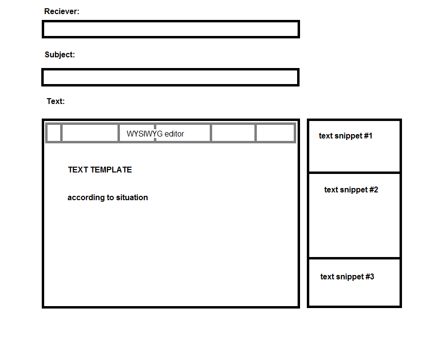

Hosted here: http://eve-stuff.com/index.php


# EVE-srpmail

This is a small and simple tool to make the tedious task of of writing SRP mails easier for officers.  
This works for all corporations not just EVE uni as it pulls the infos about the corps and chars dynamically from the API.  
Nothing will be save on the server itself for longer than the session.
As of now it only works if contracts are in stations not in citadels.
If all endpoints are implemeted, it would remove the need to be ingame at all which would mean SRP could be done on the go e.g. through our phone.


## Future plans

#### General

* [x] corp name lookup for mails instead of static (possibly save name in session on login/auth)
* [x] Replace header corp name with logo, also make it dynamic lookup
* [x] add some loading indicator (especially for loading members) since that can take up to 15 seconds
* [ ] autoclose mails notifications after some time
* [ ] fix bug with contract status not refeshing
  * [ ] deleted/timed out contracts don't disappear from list as the javascript only add's and doesn't remove
* [x] switch over to esi-api for contracts when the endpoint is implemeted
* [ ] make it work with citadels
* [ ] don't autoload contracts (?)
* [ ] show logged in char
* [ ] save sent mails in cookies instead of session, otherwise on session timeout sent mails not marked anymore
* [x] fix "session already started" console warning
* [ ] use TravisCI for auto code cleanup on realease branch commit
* [x] save finished contracts in cookies to make persistent over sessions


#### Tabs

* [ ] for all tabs: first put in killmail to to fetch info such as reciever name/fit for comparison and to put it in text template
  * [ ] support zkill and euni killboard by fetching actuall esi killmail from the pasted link
* [ ] Money SRP
  * [ ] possibly make payments through api (NO endpoint yet)
  * [ ] selection with ISK reimbursement amounts, autofetched from somewhere (srp google docs?)
* [ ] Contract SRP
  * [ ] possibilty to create conracts from the api (NO endpoint yet)
  * [ ] possible problems with ships beeing inside locked containers
* [ ] General Text
  * [ ] with different templates depending on rejection/resubmission
* [ ] Fitting comparison (maybe as standalone for normal users)
  * [ ] Visual Requirement comparison for BLAP fits from killboard links
  * [ ] Use group ID or SDE and meta level to account for upgrades
  * [ ] Automatically pull fitting comparison from fleetup or similar
  * [ ] From killmail link, automatically find fit to compare to

#### Mail UI
* [ ] all tabs use same message ui with one text field, just different templates
* [ ] adapt wysiwyg editor to support ccps custom tags
* [ ] list of common text snippets, added by clicking




# Install

### Install Prerequisites

```
sudo apt-get install php-curl
sudo apt-get install php-mbstring
sudo apt-get install php-xml
sudo service apache2 restart
sudo apt-get install composer
```

### Get source
Clone repo in webfolder or symlink repo to webfolder, eg.:
```
git clone git@github.com:jbs1/eve-srpmail.git
sudo ln -sf ~/eve-srpmail/ /var/www/html
```

### Dependencies
You need the repo with the esi php client. Put it in the same dir as eve-srpmail.
```
git clone git@github.com:jbs1/esi-phpclient.git
```

After you setup the repo you need to install the composer dependencies by running:
```
composer install
```
in the root of the repo.


#### Library's used
The following library's were used:
* [Composer](https://getcomposer.org/download/)
* CCP's [ESI API](https://esi.tech.ccp.is/latest/)
  * To update the API simply replace the folder with the generated PHP client from the new swagger.json.
  * To use the api, every PHP document must include the api [manually](https://github.com/jbs1/eve-srpmail/tree/master/SwaggerClient-php#manual-installation).
* [OAuth Client](https://github.com/thephpleague/oauth2-client)
  * Installed via compser (`composer require league/oauth2-client` inside the repo's root folder)
